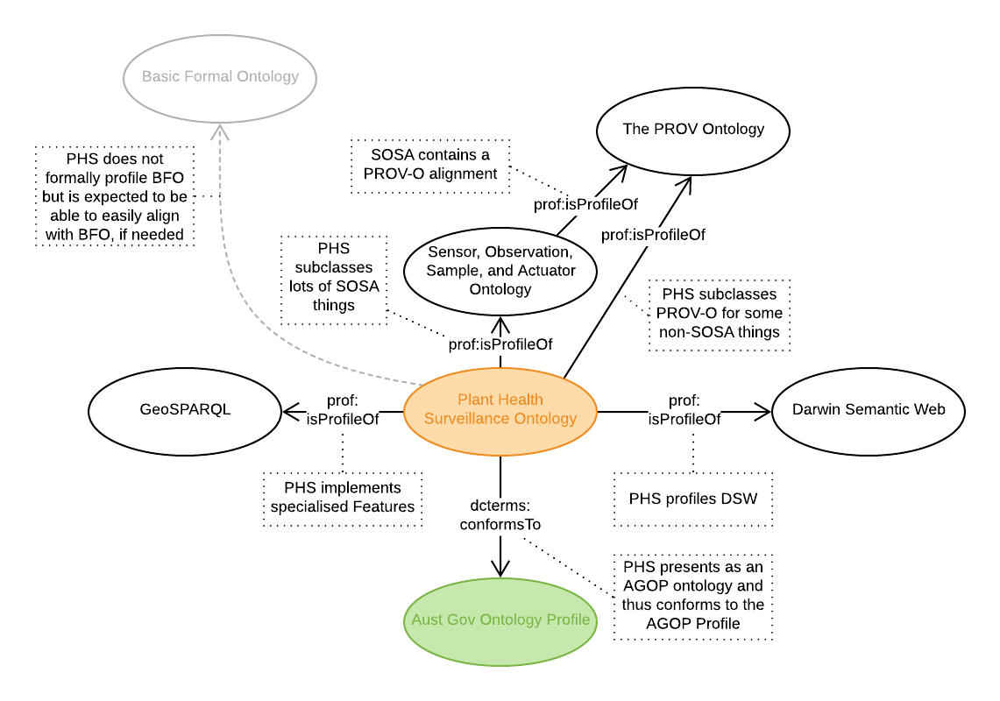

# Alignment

Here are documented, in human-readable form, the upper and peer alignments of the PHS Ontology.

## Upper Alignments

  
**Figure 1**: Upper alignments of the PHS Ontology with well-known obtologies.

The PHS Ont aligns with a number of *upper* ontologies, that is ontologies that are more abstract and which PHS Ont specialises. Alignment is implemented by use of the [Profiles Vocabulary (PROF)](https://www.w3.org/TR/dx-prof/) where the alignment relationship is `prof:isProfileOf` from PHS to the upper ontology. The specifics of what the profiling entails is captured in the PHS ontology artifact.

### Profiles Hierarchy
The profiles hierarchy, as per **Figure 1**, is stored in the file [profiles.ttl](../profiles.ttl) which is formulated according to PROF.
